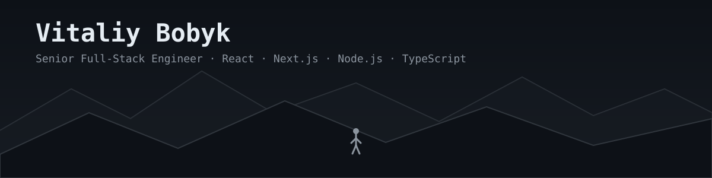

 

 

### About

Full-stack engineer with 5+ years building products used by 100K+ people, at companies (Snyk, Contentsquare) where speed, reliability, and code quality aren't up for debate. I own things end-to-end — architecture, API design, the UI on top of it, and what happens after it ships.

I work best where ownership actually means something: shaping a solution with product and design, shipping it, and staying close enough to watch how it behaves in production. Currently based in Lviv, Ukraine — open to remote-first Full-Stack / Front-End roles with teams in the EU or US.

 

### Currently building

**[Bound](https://bound.co) — FX Hedging Fintech Platform**
A platform that automates FX hedging for businesses with international exposure. React/Next.js dashboard for live currency exposure and one-click trade booking, a Node.js/TypeScript backend exposing REST/GraphQL APIs, PostgreSQL for transactional data, and live integrations across six external financial systems (Xero, QuickBooks, NetSuite, Stripe, Revolut, bank feeds) — handling OAuth, webhooks, and data sync end to end.

 

### Stack

<table>
<tr>
<td valign="top" width="50%">

**Frontend**
 

**Backend**
 

</td>
<td valign="top" width="50%">

**Cloud &amp; DevOps**
 

**Mobile**
 

**Testing &amp; AI workflow**
 

</td>
</tr>
</table>

 

 

 

Building things I'd actually want to use myself. Based in Lviv, Ukraine — open to remote-first roles (EU/US).

